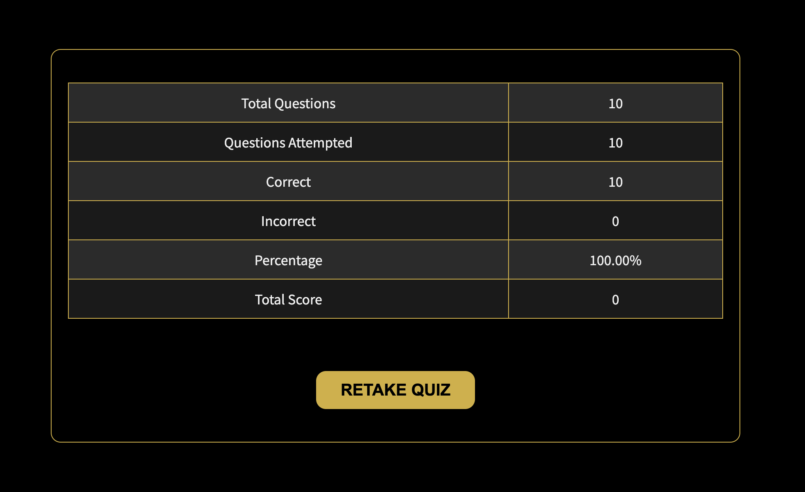

# Harry Potter Quiz

The **Harry Potter Quiz** website is a magical, interactive take on testing your knowledge of the beloved Harry Potter series.

Users of this website will be able to challenge themselves with a series of questions related to the Harry Potter books and movies. Users will be able to select the correct answers from multiple choices and see how well they know the wizarding world.

The website offers a fun and engaging way to take a break while potentially improving users' knowledge of Harry Potter trivia.

The live link can be found here - [Harry Potter Quiz](https://bryangon13.github.io/Harry-Potter-Quiz/)

## Features

### Existing Features

- __The Logo__

    - Featured at the top of the page, the harry potter deathley hallows logo is easy for the user to identify. 

    

- __The Game Area__

    - This section will allow users to participate in the Harry Potter Quiz.
    - Users will be presented with a series of multiple-choice questions about the Harry Potter series. Each question will have four possible answers to choose from.
    - The users will be able to select one of the four options as their answer. When the mouse hovers over an option, it will turn into a pointer to enhance the user experience.

    

- __The Result Area__

    - This section will allow users to see the results of the quiz.
    - Users will be able to view a detailed summary of their performance, including the number of questions attempted, correct answers, incorrect answers, percentage score, and total score.
    - The result area provides immediate feedback, helping users understand their knowledge level of the Harry Potter series.

     

### Features Left to Implement

- User can create a username.
- Feedback.

## Testing
- I tested that this Harry Potter quiz works in different browsers: Chrome, Firefox, and Safari.
- I confirmed that this project is responsive, looks good, and functions on all standard screen sizes using the devtools device toolbar.
- I confirmed that the heading, question display area, options area, result area, and score display are all readable and easy to understand.
- I confirmed that a regression testing was successfully conducted, working as intended after code runs and delivering expected actions:

    -  Action 1: Website loads.
    -  Action 2: User selects an answer.
    -  Action 3: Website checks the selected answer and highlights whether it is correct or incorrect.
    -  Action 4: User clicks the "Next" button.
    -  Action 5: Website loads the next question and updates the question counter.
    -  Action 6: After the final question, the website displays the quiz results including total questions, attempted questions, correct answers, incorrect answers, percentage, and total score.
    -  Action 7: User can click the "Retake Quiz" button to restart the quiz from the beginning.

- I ensured that all elements and functionalities work seamlessly across different devices and screen sizes.

## Validator Testing

- #### HTML

    - No errors were returned when passing through the official W3C Markup Validator.
    - [W3C Markup Validation](https://validator.w3.org/nu/?doc=https%3A%2F%2Fbryangon13.github.io%2FHarry-Potter-Quiz%2F).

- #### CSS

    - No errors were found when passing through the official W3C CSS Validator. 
    - [W3C CSS Validation - Jigsaw](https://jigsaw.w3.org/css-validator/validator?uri=https%3A%2F%2Fbryangon13.github.io%2FHarry-Potter-Quiz%2F&profile=css3svg&usermedium=all&warning=1&vextwarning=&lang=en).

- #### JavaScript

    - No errors were found when passing through the official JSHint Validator.
    - [JSHint](https://jshint.com/).

- #### Accessibility 

    - The site achieved a Lighthouse accessibility score of 100% which confirms that the colours and fonts chosen are easy to read and accessible.

### Device Testing

- The website was viewed on a variety of devices such as Desktop, Laptop, iPhone 8, iPhoneX and iPad to ensure responsiveness on various screen sizes. The website performed as intended. The responsive design was also checked using Chrome developer tools across multiple devices with structural integrity holding for the various sizes.
- I also used the following websites to test responsiveness:
    - [Am I Responsive](https://ui.dev/amiresponsive?url=https://bryangon13.github.io/Harry-Potter-Quiz/)

### Friends and Family User Testing

Friends and family members were asked to review the quiz and documentation to point out any bugs and/or user experience issues.

### Unfixed Bugs

- No unfixed bugs

### Languages
- HTML5
- CSS
- JavaScript

### Frameworks - Libraries - Programs Used
- [Am I Responsive](http://ami.responsivedesign.is/) - Used to verify responsiveness of website on different devices.
- [Chrome Dev Tools](https://developer.chrome.com/docs/devtools/) - Used for overall development and tweaking, including testing responsiveness and performance.
- [Font Awesome](https://fontawesome.com/) - Used for Social Media icons in footer.
- [GitHub](https://github.com/) - Used for version control and hosting.
- [Google Fonts](https://fonts.google.com/) - Used to import and alter fonts on the page.
- [W3C](https://www.w3.org/) - Used for HTML & CSS Validation.
- [JSHint](https://jshint.com/) - Used for JavaScript Validation.

## Deployment

The project was deployed using GitHub pages. The steps to deploy using GitHub pages are:

1. Go to the repository on GitHub.com
2. Select 'Settings' near the top of the page.
3. Select 'Pages' from the menu bar on the left of the page.
4. Under 'Source' select the 'Branch' dropdown menu and select the main branch.
5. Once selected, click the 'Save'.
6. Deployment should be confirmed by a message on a green background saying "Your site is published at" followed by the web address.

The live link can be found here - [Harry Potter Quiz](https://bryangon13.github.io/Harry-Potter-Quiz/)

## Credits

### Content

- The structure and logic for displaying and managing quiz questions were developed with the assistance of ChatGPT.
- The color scheme and inspiration for the design were taken from the Wizarding World website.
- The typography used on the website is provided by Google Fonts.
- The background images and icons are inspired by the Harry Potter theme.

### Media

All images and videos were sourced from the below websites:

- [Turbologo](https://turbologo.com/logo-maker/templates/5097676-letters-h-p-harry-potter-logo)

### Resources Used

- [W3Schools](https://www.w3schools.com/)
- [Stack Overflow](https://stackoverflow.com/)

## Acknowledgments
My mentor Antonio for his support and advice.

The Code Institute slack community for their quick responses and very helpful feedback.
