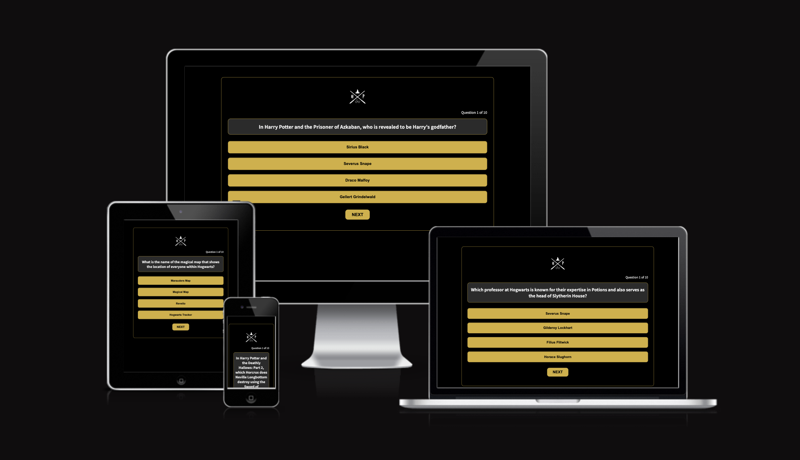
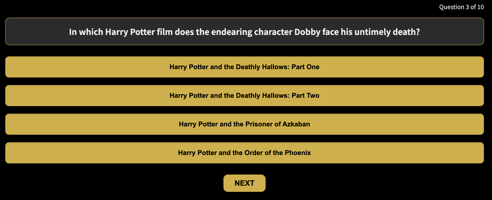

# Harry Potter Quiz

The **Harry Potter Quiz** website is a magical, interactive take on testing your knowledge of the beloved Harry Potter series.

Users of this website will be able to challenge themselves with a series of questions related to the Harry Potter books and movies. Users will be able to select the correct answers from multiple choices and see how well they know the wizarding world.

The website offers a fun and engaging way to take a break while potentially improving users' knowledge of Harry Potter trivia.

The live link can be found here - [Harry Potter Quiz](https://bryangon13.github.io/Harry-Potter-Quiz/)

## Features

### Existing Features

- __The Logo__

    - Featured at the top of the page, the harry potter deathley hallows logo is easy for the user to identify. 

    

- __The Game Area__

    This section will allow users to participate in the Harry Potter Quiz.
    Users will be presented with a series of multiple-choice questions about the Harry Potter series. Each question will have four possible answers to choose from.
    The users will be able to select one of the four options as their answer. When the mouse hovers over an option, it will turn into a pointer to enhance the user experience.

    

